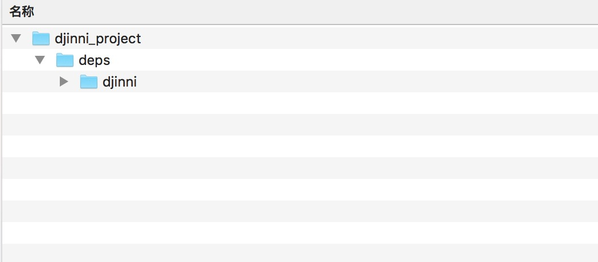
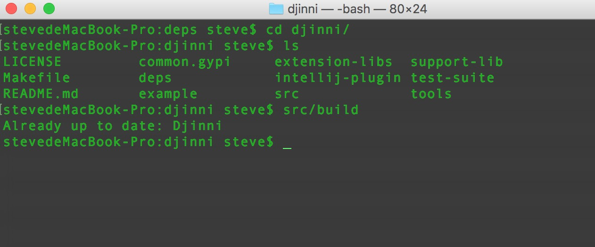
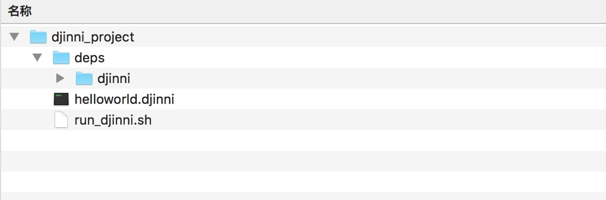
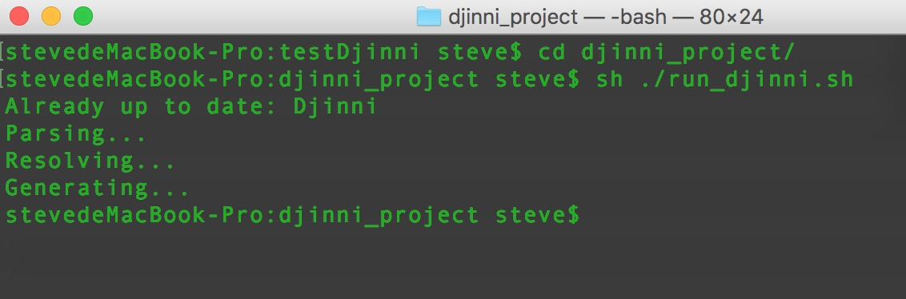
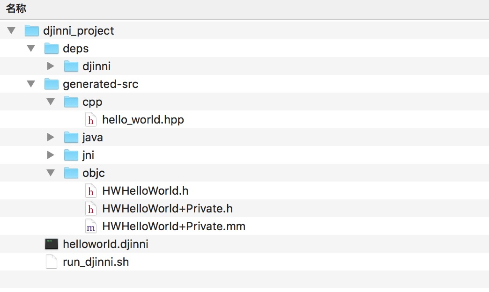
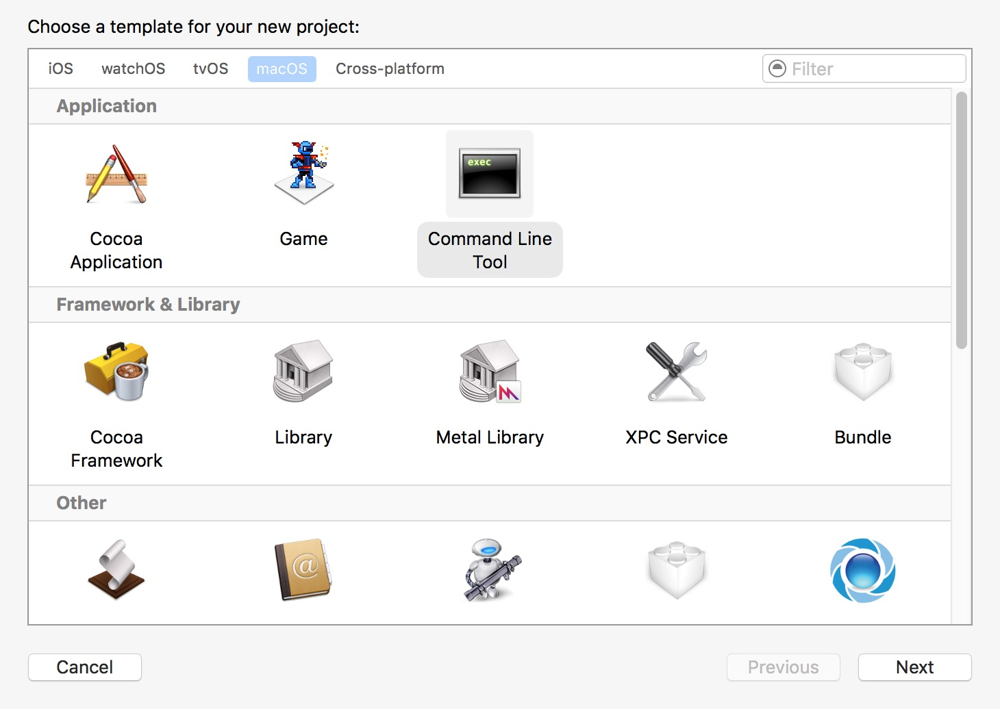
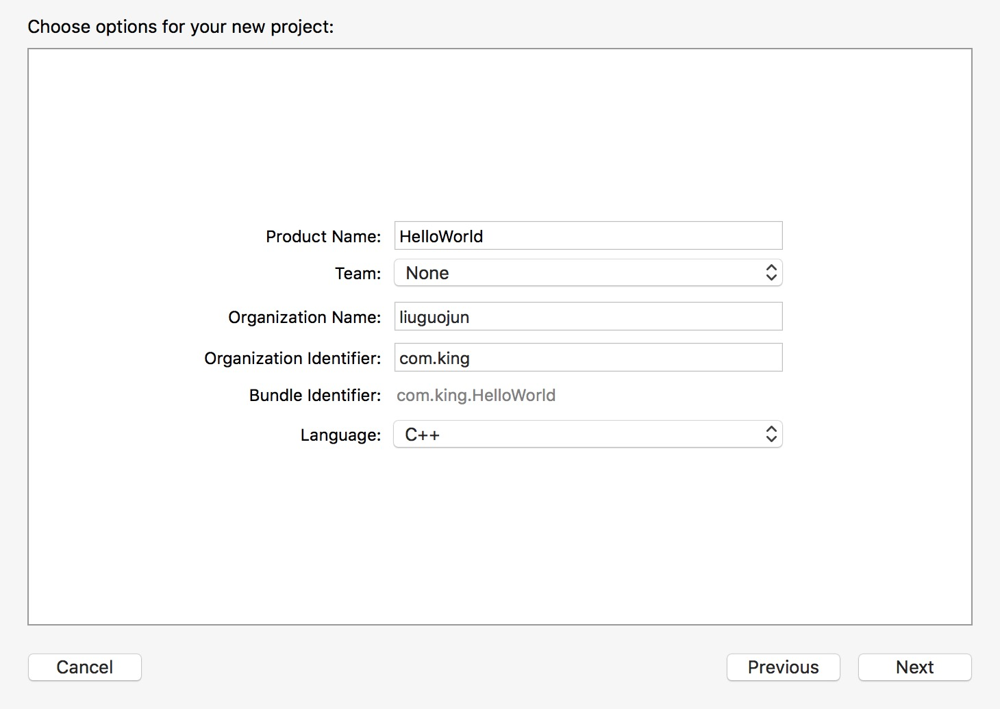
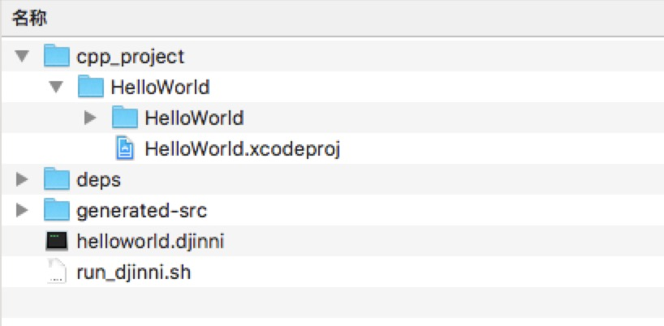
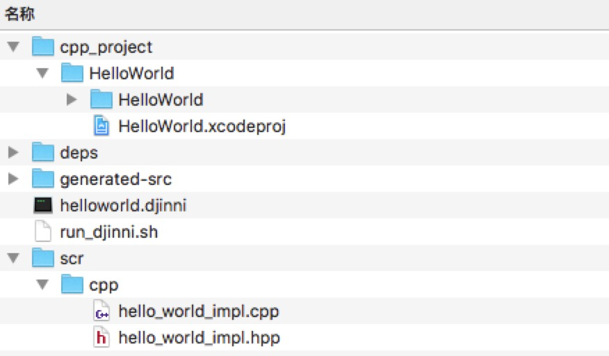
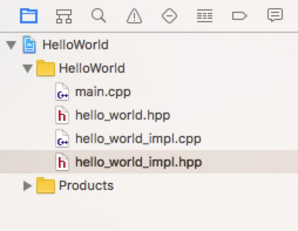

# djinni
一个根据djinni写成的demo（ios），解决了macOS Sierra下第一次build时出错的问题

# djinni介绍
Djinni 是一个用来生成跨语言的类型声明和接口绑定的工具，主要用于 C++ 和 Java 以及 Objective-C 间的互通。

- 好处：
 - 用了接口描述文件。声明清晰、修改简易，并保证了跨平台接口的一致性。
 - 自动生成接口绑定代码。免去了绑定 C++ 和 Java (JNI) 及 Objective-C (Objective-C++) 的麻烦。

# 1 配置djinni

## 1.1 下载djinni
	https://github.com/dropbox/djinni.git
将下载好的djinni放在[example_root]/deps/ 下

此时目录结构为：

## 1.2 编译djinni
	$ cd [djinni_root]/
	$ src/build
	

	
第一次编译的时候会去下载sbt配置

本人系统环境是macOS Sierra 10.12 , 在此环境下sbt下载失败，导致编译失败

如果sbt下载失败的话，项目中放置了一个sbt的压缩包（里边文件默认隐藏的），复制里边的文件到你的用户文件夹下就可以了

# 2 使用djinni

## 2.1 编写djinni格式文件
 
	hello_world = interface +c {
    	static create():hello_world;
    	get_hello_world(): string;
    	get_name(): string;
    	set_name(name:string);
	}
	
命名为helloworld.djinni 并放置在[example_root]/ 下
	
## 2.2 编写shell文件

	#! /usr/bin/env bash
 
	base_dir=$(cd "`dirname "0"`" && pwd)
	cpp_out="$base_dir/generated-src/cpp"
	jni_out="$base_dir/generated-src/jni"
	objc_out="$base_dir/generated-src/objc"
	java_out="$base_dir/generated-src/java/com/mycompany/helloworld"
	java_package="com.mycompany.helloworld"
	namespace="helloworld"
	objc_prefix="HW"
	djinni_file="helloworld.djinni"
 
	deps/djinni/src/run \
   		--java-out $java_out \
   		--java-package $java_package \
   		--ident-java-field mFooBar \
   		\
   		--cpp-out $cpp_out \
   		--cpp-namespace $namespace \
   		\
   		--jni-out $jni_out \
   		--ident-jni-class NativeFooBar \
   		--ident-jni-file NativeFooBar \
   		\
   		--objc-out $objc_out \
   		--objc-type-prefix $objc_prefix \
   		\
   		--objcpp-out $objc_out \
   		\
   		--idl $djinni_file

命名为run_djinni.sh 并放置在[example_root]/ 下

此时目录结构为：

## 2.3 生成接口代码

	$ cd [example_root]/  
	$ sh ./run_djinni.sh
	
运行成功输出：

以及现在目录结构：

	
这里可以看到：依据描述文件helloworld.djinni，在generated-src目录下自动生产了 C++ 和 Java 及 Objective-C 的绑定代码。继续要做的，只是写它们的具体实现

# 3 编写c++代码
## 3.1 创建c++工程
这里用 XCode 创建一个 C++ 工程，来测试 C++ 接口代码。

首先，打开 XCode ，选择”Create a new Xcode project”。然后，选择”Command Line Tool”，来新建命令行工具。

“Next”到下一步时，”Language”选择”C++”。

“Next”到下一步，放在[example_root]/ 下

此时目录结构为：

## 3.2 编写c++实现代码

首先在[example_root]/ 下创建src/cpp目录，用来存放c++实现代码

src/cpp/hello\_world\_impl.hpp:

	#pragma once
 
	#include "hello_world.hpp"
 
	namespace helloworld {
    
    	class HelloWorldImpl : public helloworld::HelloWorld {
        
    	public:
        
        	// Constructor
        	HelloWorldImpl();
        
        	// Our method that returns a string
        	std::string get_hello_world();
        
    	};
    
	}

src/cpp/hello\_world\_impl.cpp:

	#include "hello_world_impl.hpp"
	#include <string>
 
	namespace helloworld {
    
    	std::shared_ptr<HelloWorld> HelloWorld::create() {
    	    return std::make_shared<HelloWorldImpl>();
    	}
    	
    	HelloWorldImpl::HelloWorldImpl() {
 	
    	}
    
    	std::string HelloWorldImpl::get_hello_world() {
        
     	   std::string myString = "Hello World! ";
        
       	 time_t t = time(0);
       	 tm now=*localtime(&t);
        	char tmdescr[200]={0};
        	const char fmt[]="%r";
        	if (strftime(tmdescr, sizeof(tmdescr)-1, fmt, &now)>0) {
        	    myString += tmdescr;
        	}
        
        	return myString;
        
    	}
    
	}
	

此时目录结构为：

## 3.3 调试c++代码

接下来，把以下 C++ 接口代码文件，拖动到 Xcode 工程目录来引入(只需引用文件，避免复制。)

	generated-src/cpp/hello_world.hpp
	src/cpp/hello_world_impl.cpp
	src/cpp/hello_world_impl.hpp

此时目录结构为：

编写以下代码：

	#include <iostream>
	using namespace std;

	#include "hello_world_impl.hpp"

	int main(int argc, const char * argv[]) {

    	helloworld::HelloWorldImpl hw = helloworld::HelloWorldImpl();
    
    	string myString = hw.get_hello_world();
    	cout << myString << endl;
    
    	return 0;
	}
	
输出为:

	Hello World! 02:28:10 PM
	
c++代码调试通过